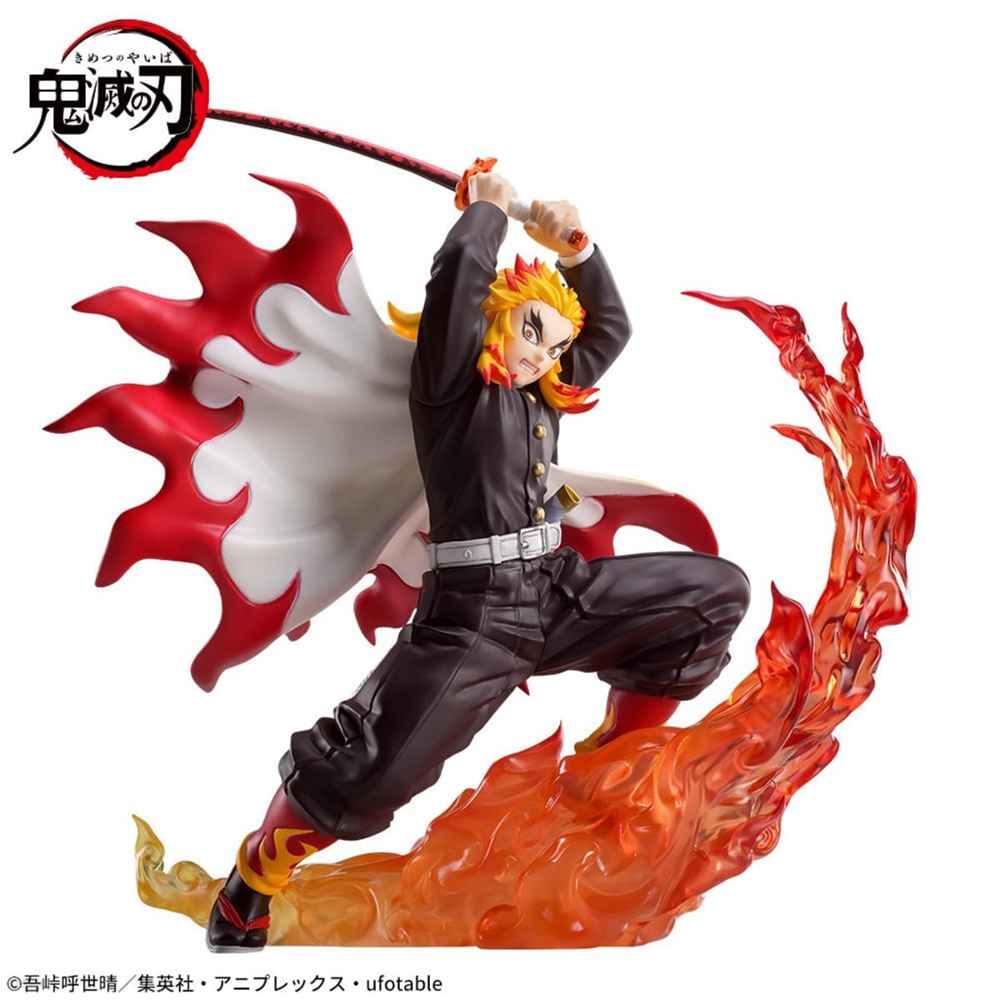
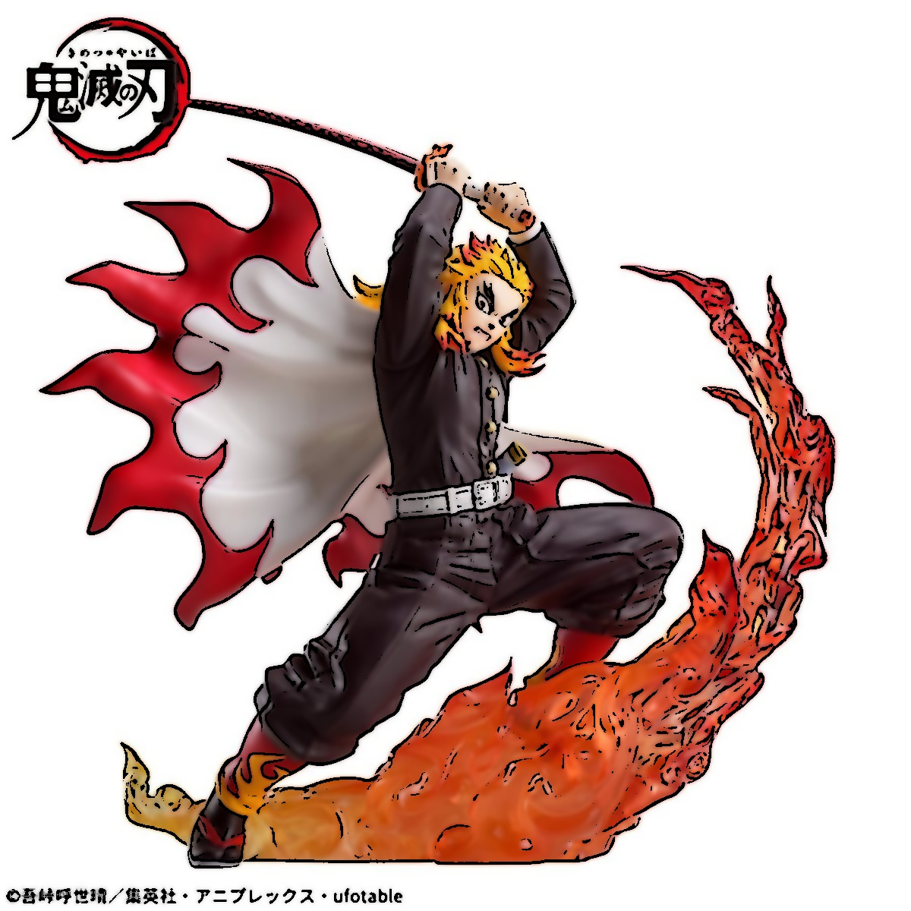
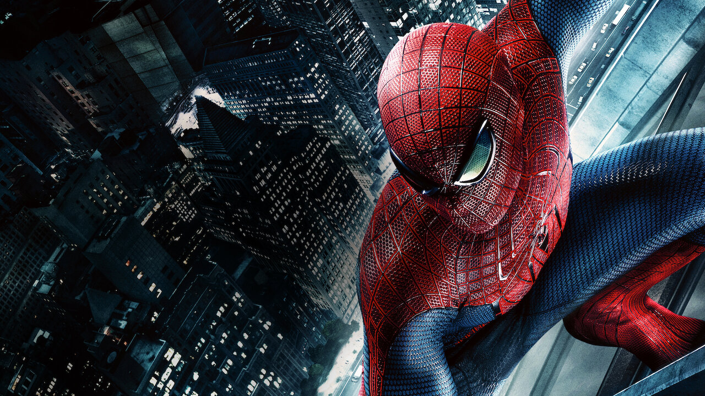
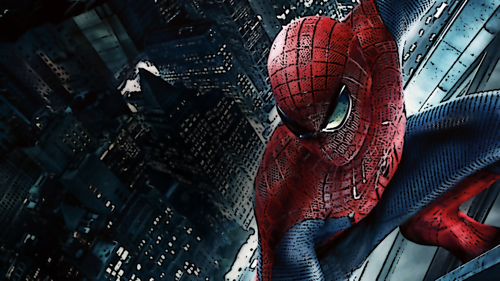
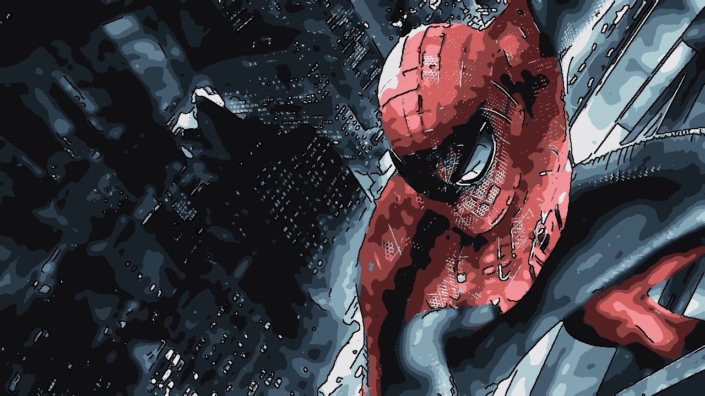
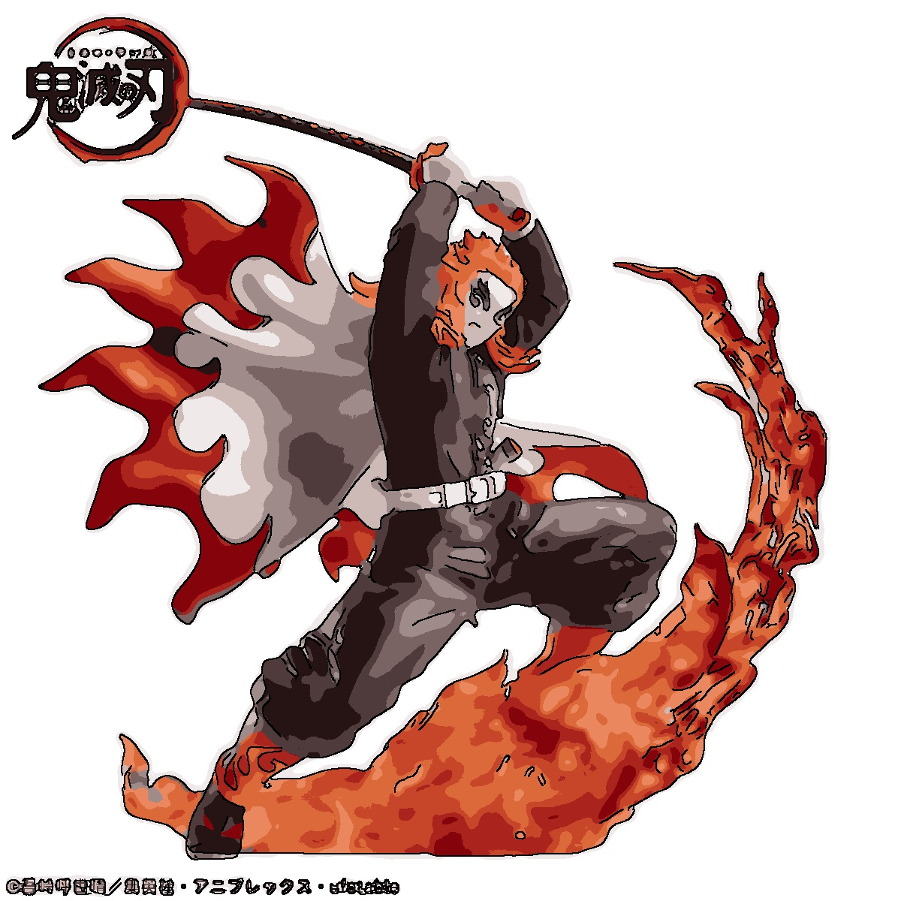

# Free_Cartoonization : Using Kmeans and Blur

## 알고리즘 설명

OpenCV의 이미지 처리 기법을 조합하여 카툰 스타일 변환을 구현하였다.

**파이프라인:**
1. **그레이스케일 변환** (`cvtColor`) - 엣지 검출을 위한 전처리
2. **Median Blur** (`medianBlur`, ksize=5) - 노이즈 제거
3. **Adaptive Threshold** (`adaptiveThreshold`, blockSize=9, C=9) - 카툰 외곽선 생성
4. **Bilateral Filter** (`bilateralFilter`, d=9, sigmaColor=250, sigmaSpace=250) - 색상 영역을 부드럽게 평탄화하여 만화적 색감 표현
5. **bitwise_and** - 엣지 마스크와 평탄화된 컬러 이미지를 합성

핵심은 Bilateral Filter로 색상을 평탄화하면서도 경계를 보존하고, Adaptive Threshold로 검출한 외곽선을 오버레이하여 만화 느낌을 내는 것이다.

---

## 잘 표현된 이미지 데모

**입력:** `cartoon_simple2.png` (귀멸의 칼날 피규어)

| 원본 | 카툰 변환 |
|------|-----------|
|  |  |

피규어 이미지는 카툰 변환이 잘 적용된다. 이유는 다음과 같다:
- **배경이 단순(흰색)** 하여 불필요한 엣지가 적게 검출됨
- **피사체의 색상 영역이 명확** (빨강, 검정, 흰색 등)하여 Bilateral Filter의 색상 평탄화가 효과적
- **원본 자체가 애니메이션 스타일** 의 피규어이므로 평탄화된 색감과 외곽선이 자연스럽게 어울림
- 불꽃, 옷, 칼 등의 경계가 뚜렷하여 Adaptive Threshold가 깔끔한 윤곽선을 생성

---

## 잘 표현되지 않는 이미지 데모

**입력:** `cartton_simple.png` (스파이더맨 실사 영화 장면)

| 원본 | 카툰 변환 |
|------|-----------|
|  |  |

실사 영화 장면은 카툰 변환이 잘 되지 않는다. 이유는 다음과 같다:
- **어두운 배경(야경 도시)** 에서 Adaptive Threshold가 과도한 엣지(노이즈)를 검출하여 배경이 지저분해짐
- **복잡한 텍스처** (스파이더맨 슈트의 거미줄 패턴, 빌딩 창문 등)가 모두 엣지로 검출되어 만화적 단순함이 사라짐
- **조명 그라데이션이 복잡** 하여 Bilateral Filter만으로는 색상이 충분히 평탄화되지 않음
- 결과적으로 원본과 큰 차이가 없거나, 오히려 엣지 노이즈로 인해 품질이 저하됨

---

## 간단한 기존 알고리즘의 한계점

1. **어두운 이미지 / 저조도 환경에 취약**
   - Adaptive Threshold는 로컬 영역의 밝기 차이를 기반으로 엣지를 검출하므로, 어두운 영역에서 노이즈성 엣지가 과도하게 발생한다.

2. **복잡한 텍스처를 단순화하지 못함**
   - 실사 이미지의 세밀한 텍스처(옷감, 피부 모공, 건물 패턴 등)가 모두 엣지로 검출되어 만화 특유의 단순한 외곽선 표현이 어렵다. 만화는 중요한 윤곽선만 남기고 나머지를 생략하는 것이 핵심인데, 본 알고리즘은 중요한 엣지와 불필요한 엣지를 구분하지 못한다.

3. **색상 평탄화의 한계**
   - Bilateral Filter는 색상 경계를 보존하면서 평탄화하지만, 실사 이미지의 복잡한 조명/그라데이션에서는 충분한 평탄화가 이루어지지 않는다. 반복 적용(iteration)하면 개선되지만 처리 시간이 크게 증가한다.

4. **파라미터 의존성**
   - blockSize, sigmaColor 등의 파라미터가 이미지 특성에 따라 최적값이 달라진다. 한 이미지에서 잘 작동하는 파라미터가 다른 이미지에서는 좋지 않은 결과를 낼 수 있다.

---

## 한계점 극복: 개선된 알고리즘 (`change_improve.py`)

위 한계점을 해결하기 위해 파이프라인을 개선하였다.

**개선된 파이프라인:**
1. **Bilateral Filter 반복 적용** (7회) - 1회로는 부족한 색상 평탄화를 반복 적용으로 강화
2. **GaussianBlur + MedianBlur 이중 전처리** - 세밀한 텍스처(거미줄 패턴 등)를 엣지 검출 전에 사전 제거
3. **Canny Edge Detection** (threshold 80/150) - Adaptive Threshold 대신 사용하여 주요 윤곽선만 추출
4. **CLAHE 대비 보정** - 어두운 영역의 대비를 개선하여 저조도 환경에서의 노이즈 억제
5. **K-Means 색상 양자화** (k=12) - 색상 수를 12색으로 제한하여 만화 특유의 단색 영역 표현

### 한계점별 개선 내용

| 한계점 | 기존 접근 | 개선 방법 |
|--------|-----------|-----------|
| 어두운 영역 노이즈 | 처리 없음 | **CLAHE** 로 어두운 영역의 대비를 균일화하여 안정적인 엣지 검출 |
| 복잡한 텍스처 검출 | Adaptive Threshold가 모든 텍스처를 엣지로 검출 | **강한 블러 전처리 + Canny**(높은 threshold)로 주요 윤곽만 추출 |
| 불충분한 색상 평탄화 | Bilateral Filter 1회 | **7회 반복 적용 + K-Means 양자화** 로 만화적 단색 영역 생성 |

### 개선 결과 비교

**스파이더맨 (어두운 배경 + 복잡한 텍스처)**

| 원본 | 기존 알고리즘 | 개선 알고리즘 |
|------|---------------|---------------|
|  |  |  |

- 거미줄 패턴의 세밀한 엣지가 대폭 감소하여 깔끔한 외곽선만 남음
- 어두운 배경의 노이즈 엣지가 억제됨
- K-Means 양자화로 색상이 단순화되어 만화적 느낌이 강화됨

**귀멸의 칼날 피규어 (밝은 배경 + 단순한 구조)**

| 원본 | 기존 알고리즘 | 개선 알고리즘 |
|------|---------------|---------------|
|  |  |  |

- 기존에도 잘 표현되던 이미지는 개선 알고리즘에서도 양호한 결과를 보임
- K-Means 양자화로 색상이 더욱 단순화되어 만화 느낌이 강화됨
